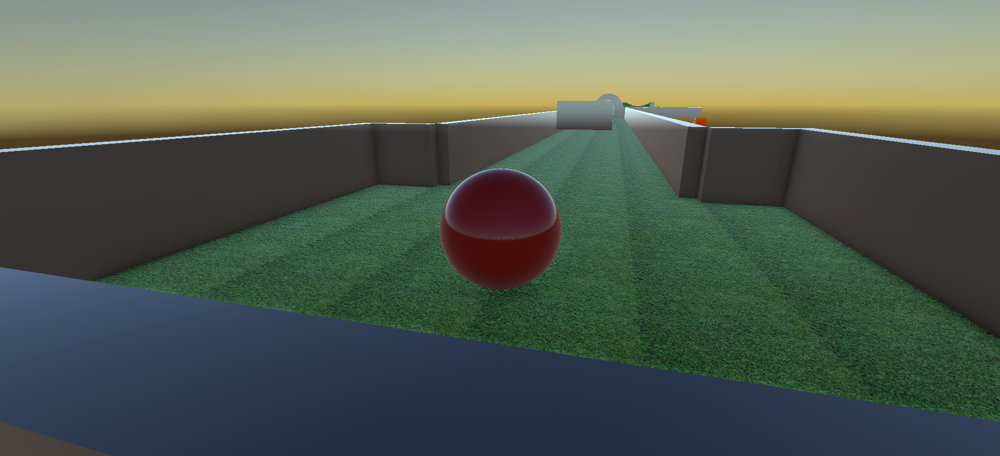
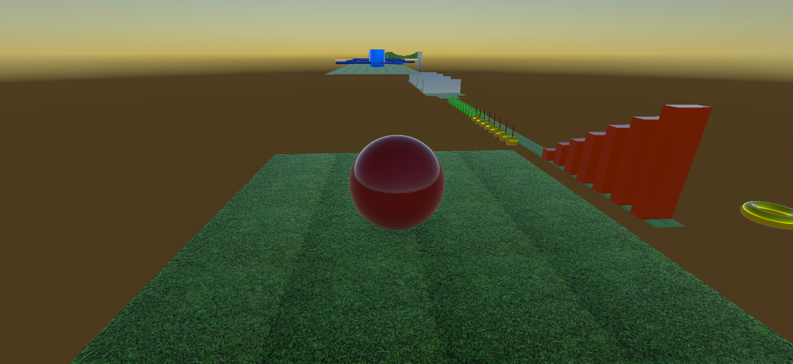
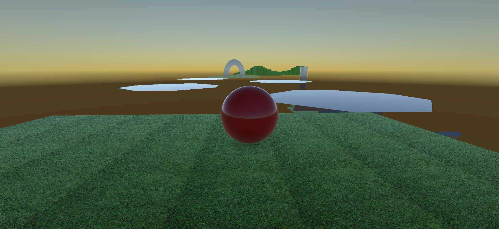
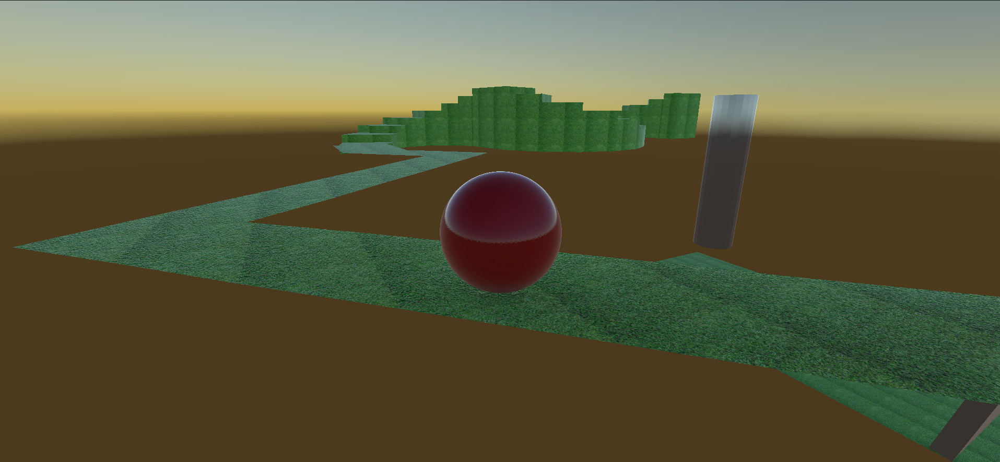
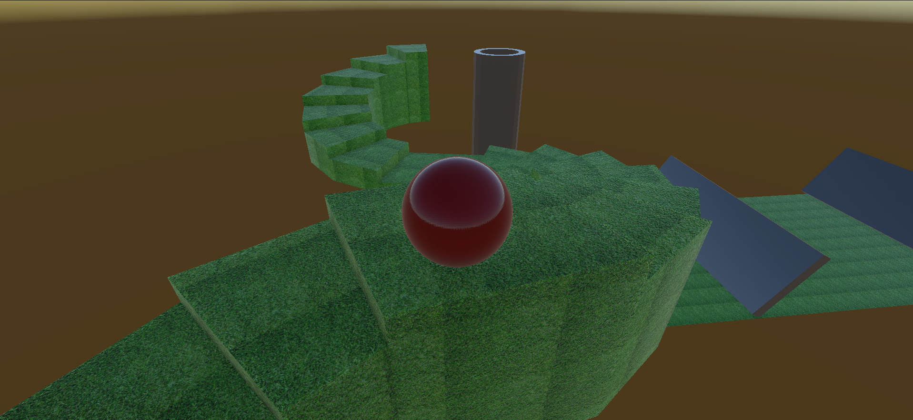
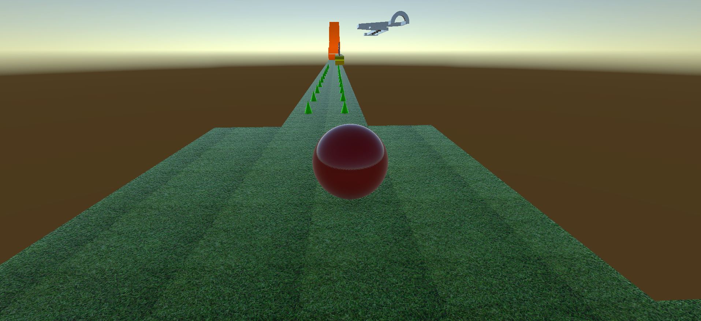

# 🟢 ROLL-A-BALL

Proyecto 3D desarrollado con **Unity y C#**, enfocado en el movimiento de un objeto mediante física y las mecánicas básicas de interacción dentro de un escenario.

El jugador controla una esfera que debe desplazarse por el entorno, superar obstáculos y completar los objetivos del nivel utilizando un sistema de movimiento basado en `Rigidbody`.

---

## 🎥 Gameplay

[▶️ Ver gameplay en YouTube](https://www.youtube.com/watch?v=tDpAYdThlVY)

---

## 🛠️ Tecnologías

- Unity
- C#
- 3D
- Rigidbody
- Física
- Gameplay
- Git / GitHub

---

## ✨ Características

- Movimiento basado en física.
- Control de una esfera mediante `Rigidbody`.
- Sistema de salto.
- Colisiones físicas.
- Obstáculos.
- Escenario 3D.
- Mecánicas de interacción.
- Control del jugador.
- Diseño básico de nivel.

---

## 🎮 Mecánica principal

El jugador controla una esfera dentro de un escenario 3D.

Durante la partida debe:

1. Mover la esfera por el escenario.
2. Utilizar la física para desplazarse.
3. Superar obstáculos.
4. Interactuar con diferentes elementos.
5. Completar los objetivos del nivel.

---

## 📸 Capturas del proyecto

### Gameplay

### Movimiento

### Física

### Escenario

### Obstáculos

### Gameplay

---

## 🎯 Objetivo del proyecto

El objetivo de este proyecto fue comprender y aplicar conceptos fundamentales del desarrollo de videojuegos 3D utilizando Unity.

El proyecto estuvo enfocado principalmente en el uso de físicas, movimiento mediante `Rigidbody`, colisiones y creación de una experiencia jugable básica.

---

## 💻 Programación y sistemas desarrollados

Durante el desarrollo trabajé principalmente en:

- Movimiento mediante `Rigidbody`.
- Aplicación de fuerzas.
- Control del jugador.
- Sistema de salto.
- Detección de colisiones.
- Interacción con el escenario.
- Física del jugador.
- Organización de escenas y objetos.

---

## 📚 Aprendizajes

Este proyecto me permitió reforzar conocimientos sobre:

- Programación en C#.
- Desarrollo de videojuegos 3D.
- Uso de `Rigidbody`.
- Física en Unity.
- Colisiones.
- Movimiento de personajes.
- Diseño básico de niveles.
- Organización de proyectos.
- Control de versiones con Git y GitHub.

---

## 👨‍💻 Autor

**Andrés Yesid Niño Galvis**

Game Developer en formación.

### Tecnologías principales

**Unity · C# · 3D · Rigidbody · Física**

---

## 🌐 Portafolio

Puedes conocer más sobre mis proyectos en:

**https://andresnino12.github.io**
